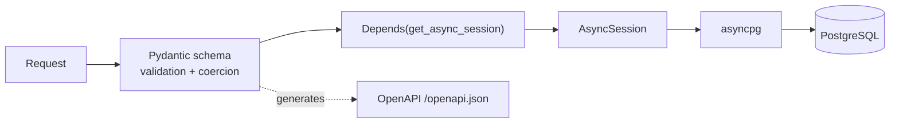

# 0003. FastAPI with async SQLAlchemy over asyncpg

- **Status:** Accepted
- **Date:** 2026-08-10
- **Deciders:** llevintza
- **Landed in:** PR #1 (`81b373b`)
- **Related:** [ADR-0004](0004-postgresql-as-the-datastore.md), [ADR-0006](0006-fastapi-users-jwt-auth.md), [ADR-0012](0012-database-hosting-neon.md)

## Context

The backend is a JSON API over a relational model, consumed by a single SPA and a CLI
ingest tool. It must produce a machine-readable schema (the ingest CLI and the SPA
both benefit), validate untrusted input rigorously, and run inside 512 MB on a free
tier ([ADR-0011](0011-backend-hosting-render.md)).

Python was a given: the ingest path uses the Anthropic SDK's `messages.parse` with
Pydantic models, and sharing those models between ingest and API is worth real money
in avoided duplication.

## Decision

**FastAPI** on uvicorn, with **SQLAlchemy 2.x async ORM** over **asyncpg**.

Dependency injection through `Depends(get_async_session)`
([`backend/app/db.py`](../../backend/app/db.py)) is the single access path to the
database. That is not incidental: it is what lets `conftest.py` override one function
and redirect the entire application to a per-test engine, and it is why new endpoints
should take a session via `Depends` rather than reaching for `async_session_maker`
directly.

## Consequences

### What this buys

- **OpenAPI for free**, kept truthful by the fact that it is generated from the same
  type hints that do the validation.
- **Pydantic models shared with the ingest CLI**, so a bill parsed from a PDF and a
  bill posted from the SPA validate identically.
- **One override point for tests.** `app.dependency_overrides[get_async_session]`
  covers every endpoint.
- Async I/O suits a workload dominated by waiting on the database, and matters more
  than usual here because Neon round-trips are slow after idle.

### What this costs

- **Async is contagious and unforgiving.** Every database call must be awaited; a
  single sync call blocks the event loop. This is the main source of subtle bugs in
  this style of codebase.
- **Async SQLAlchemy has sharp edges** the sync API does not. A concrete one already
  bit this project: `User` carries a joined eager load for `oauth_accounts`, and
  `scalar_one_or_none()` on that raises `InvalidRequestError` ("the unique() method
  must be invoked") — which made the supposedly idempotent seeder fail on every
  re-run. `seed.py` now selects `User.id` rather than the entity.
- **asyncpg is not libpq**, so connection-string parameters differ. `sslmode` and
  `channel_binding` are rejected outright — see
  [ADR-0012](0012-database-hosting-neon.md).
- **Driver errors are not always SQLAlchemy errors.** SQLAlchemy only wraps what the
  driver raises *after* a connection exists; socket-level failures arrive raw as
  `OSError` subclasses. This produced a genuine bug in the readiness endpoint
  ([ADR-0014](0014-split-liveness-and-readiness-health-checks.md)).
- No background task machinery beyond `BackgroundTasks`; anything scheduled needs
  external orchestration.

## Limitations

- Single process, single worker on the current tier — no multi-worker concurrency.
- ORM overhead is irrelevant at this data size but real at scale.
- Pydantic v2 validation is fast, but deeply nested models are the usual latency
  surprise.
- `settings = Settings()` is evaluated at **import time**
  ([`config.py`](../../backend/app/config.py)), which is why `conftest.py` must set
  `os.environ` before importing `app.*`. Any future lazy-config refactor must preserve
  that ordering or the tests will silently talk to the development database.

## Alternatives considered

| Option | Why not |
| --- | --- |
| **Django + DRF** | Batteries included, but the ORM and admin are more than needed, and async support is still partial. Heavier in 512 MB |
| **Flask + SQLAlchemy (sync)** | Simpler and avoids async pitfalls entirely — but no built-in OpenAPI, no Pydantic validation, and the sharp async edges are mostly one-time costs already paid |
| **Litestar** | Very close on features and arguably cleaner DI; smaller ecosystem and less familiarity |
| **Node/TypeScript (NestJS, Fastify)** | Would unify language with the frontend, but loses the shared Pydantic models with the Anthropic ingest path — the deciding factor |
| **SQLModel** | Merges Pydantic and SQLAlchemy attractively, but obscures SQLAlchemy 2.x behaviour precisely where this project needs it visible |
| **Raw SQL + asyncpg, no ORM** | Fastest and most explicit; loses cascade declarations, Alembic autogenerate, and relationship loading |

## Revisit when

- [ ] **Background jobs are needed** (scheduled ingest, email) → add a task queue or
      move scheduling to GitHub Actions; do not grow it inside the request path.
- [ ] **The event loop is blocked** by CPU-bound work (PDF parsing in-process) → move
      it to a worker rather than threading it into the API.
- [ ] **A second consumer needs the API** → the OpenAPI schema is already there;
      consider generating a typed client instead of hand-writing one.
- [ ] **Horizontal scaling arrives** → connection pooling becomes the binding
      constraint ([ADR-0012](0012-database-hosting-neon.md)), not the framework.

## Migration path

FastAPI is not a vendor lock-in, but it is a structural one: routers, `Depends`, and
Pydantic schemas run through the whole backend. A framework change is a rewrite of the
HTTP layer, though the SQLAlchemy models, Alembic migrations and business logic in
`services/` would survive largely intact — which is the main reason business logic
lives there rather than in the routers.
