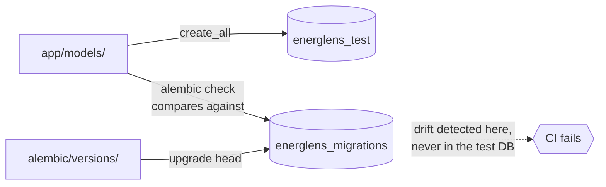

# 0005. Alembic for migrations, with three local databases

- **Status:** Accepted
- **Date:** 2026-08-10 (Alembic), 2026-08-11 (three-database scheme, `db.env`)
- **Deciders:** llevintza
- **Landed in:** PR #1 (`81b373b`), PR #6 (`84c284d`)
- **Related:** [ADR-0004](0004-postgresql-as-the-datastore.md), [ADR-0002](0002-monorepo-with-make-as-command-surface.md)

## Context

The production schema is owned by migrations, but the test suite builds its schema
with `Base.metadata.create_all` — it is faster and needs no migration history.

That combination hides a specific, dangerous failure: **if the test suite builds from
the models, running `alembic check` against the test database compares the models with
themselves and can never detect drift.** Model and migration diverge, CI stays green,
and production boots against a stale schema.

## Decision

**Alembic**, async over asyncpg with `NullPool`, applied by `start.sh` on every boot.
And **three separate local databases**, whose identity is defined once in
[`scripts/db.env`](../../scripts/db.env):

| Database | Owner | Lifecycle |
| --- | --- | --- |
| `energlens` | you | Your development data; survives |
| `energlens_test` | pytest | **Every table dropped** on each run |
| `energlens_migrations` | Alembic alone | Throwaway; rebuilt by `make migrate-check` |

`make migrate-check` builds `energlens_migrations` **from migrations only**, then runs
`alembic check` against the models. Drift has nowhere to hide.

### Why `db.env` exists

Database identity is needed by consumers that cannot read a shell file at the moment
they need it, so four keep literal copies:

| Consumer | Why it cannot source `db.env` |
| --- | --- |
| `backend/app/config.py` | Ships without `scripts/` (`render.yaml` sets `rootDir: backend`) and must do no file I/O at import time |
| CI postgres service block | Evaluated before the repository is checked out |
| `docker-compose.yml` | No shell evaluation available |
| `.env.example` | Documentation, read by humans |

**`backend/tests/test_config.py` fails if any copy drifts.** Change `db.env` and let
the test tell you what else to update — that is the intended workflow, and it is why
a silent disagreement (the app using one database while tooling uses another) cannot
merge.

## Consequences

### What this buys

- **Model/migration drift cannot merge.** `migrate-check` is a required check.
- Fast tests: `create_all` avoids replaying migration history per run.
- One source of truth for database identity, enforced by a test rather than by
  discipline.
- Production schema changes are versioned, reviewable, and reversible.

### What this costs

- **Three databases is genuinely surprising**, and the reason is not obvious from the
  names. This ADR and the AGENTS.md note exist so the next person does not "simplify"
  it into one and silently lose drift detection.
- Two of the three are destroyed routinely, so both `scripts/db.sh` and `conftest.py`
  hard-refuse to run when the target host is not localhost — whether the host comes
  from `PGHOST` or from `DATABASE_URL`. That guard is load-bearing.
- Migrations run at boot ([ADR-0011](0011-backend-hosting-render.md)), so a broken
  migration is an outage rather than a failed deploy step.
- Alembic autogenerate does not detect renames; it emits drop+add, which loses data.

## Limitations

- **No down-migrations are exercised.** `downgrade()` exists but is never run in CI,
  so rollback is untested. Forward-fix is the assumed strategy.
- Autogenerate misses renames, some constraint changes, and most data migrations.
- Migrations are not transactional across DDL on all statements; a partial failure can
  leave the schema mid-way.
- There is exactly one migration today (`d7c413da8d84`), so the chain is untested at
  length.

## Alternatives considered

| Option | Why not |
| --- | --- |
| **`create_all` in production too** | No versioning, no reviewable schema history, no safe path for column changes |
| **One database for everything** | The drift-detection hole described in Context — the entire reason this ADR exists |
| **Two databases** (dev + test, check against test) | Same hole: comparing models against a model-built schema is a tautology |
| **Atlas / Sqitch / raw SQL** | Alembic is already the SQLAlchemy-native choice; no gain worth a second toolchain |
| **Hardcode DB names in each consumer** | What `db.env` and `test_config.py` replaced — silent divergence with no signal |

## Revisit when

- [ ] **A migration needs rolling back in anger** → `downgrade()` is untested; either
      start exercising it in CI or commit explicitly to forward-fix only.
- [ ] **Migrations get slow enough to matter at boot** → move to a pre-deploy hook,
      which requires leaving Render free ([ADR-0011](0011-backend-hosting-render.md)).
- [ ] **A data migration is needed** (not just schema) → autogenerate will not help;
      write it by hand and test it against a copy.
- [ ] **A second service starts writing to this database** → boot-time migration by
      two processes races; move to an explicit deploy step.
- [ ] **The migration chain grows long enough** that rebuilding
      `energlens_migrations` slows `make check` noticeably → squash old revisions.

## Migration path

Alembic is not a vendor dependency and travels with SQLAlchemy. If the three-database
scheme is ever collapsed, **the requirement it satisfies must be replaced, not
dropped**: something must compare the models against a migration-built schema. Losing
that check is the failure this ADR exists to prevent.
