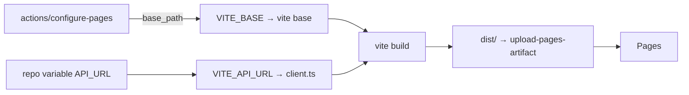

# 0010. Host the frontend on GitHub Pages

- **Status:** Accepted
- **Date:** 2026-08-10
- **Deciders:** llevintza
- **Landed in:** PR #1 (`81b373b`), base-path fix in PR #3 (`d1caed3`)
- **Related:** [ADR-0007](0007-react-vite-spa.md), [ADR-0011](0011-backend-hosting-render.md)

## Context

The frontend is a fully static bundle ([ADR-0007](0007-react-vite-spa.md)) — no SSR, no
server-side secrets, no runtime configuration. It needs global HTTPS delivery at zero
cost, and it should deploy from the same repository as the code without a separate
account or credential.

## Decision

We serve the SPA from **GitHub Pages** as a project site at
`https://llevintza.github.io/energlens/`, built and published by
[`deploy-frontend.yml`](../../.github/workflows/deploy-frontend.yml).

Two things are resolved at **build** time and inlined into the bundle:

- **The base path is read from `actions/configure-pages`**, not hardcoded. It emits
  `/energlens` for a project site and `""` behind a custom domain; appending a slash
  makes both valid Vite base paths. Renaming the repo therefore cannot break asset
  URLs again — which it previously did.
- **`postbuild` copies `index.html` → `404.html`.** Pages has no SPA rewrite rule, so
  this is how deep links survive a refresh.
- **`API_URL` is validated for shape** before the build: a scheme-less value would
  pass a `test -n` and then throw `Invalid URL` from `new URL()` on every request.

## Consequences

### What this buys

- **Free, global CDN, automatic HTTPS**, no account beyond the one hosting the code.
- **No deploy credentials.** OIDC (`id-token: write`) replaces any stored token.
- **The SPA renders without a backend.** `AuthContext` skips the network when
  `localStorage` has no token, so a visitor reaches `/login` even when the API is
  down — the site is never blank because of a backend outage.

### What this costs

- **Static only.** No SSR, no redirects, no headers we control, no edge functions. A
  future need for server-rendered pages or a CSP header set at the edge means moving.
- **The repository must be public** for Pages on a free account.
- **Build-time configuration is a genuine footgun.** `API_URL` is baked into the
  bundle, and the workflow's `paths` filter is `frontend/**` — so *changing the
  variable triggers no deploy at all.* The live bundle keeps the old value until
  someone runs `gh workflow run` by hand. This has bitten the project twice and is
  tracked in issues #10 and #11.
- **Deploys are not verified.** The workflow checks that `API_URL` looks like a URL,
  not that anything answers there (issue #11), nor that the published page loads
  (issue #10).

## Limitations

| Limit | Value |
| --- | --- |
| Site size | 1 GB |
| Bandwidth | 100 GB/month (soft) |
| Builds | 10/hour (soft) |
| Repository | Must be public on a free account |
| Server-side logic | None — static files only |
| Custom headers / redirects | Not configurable |

## Alternatives considered

| Option | Why not |
| --- | --- |
| **Cloudflare Pages** | Better free tier, real redirects/headers, edge functions. A genuinely strong option — rejected only to keep the account surface at one provider. The obvious first stop if Pages' limits bind |
| **Netlify / Vercel** | Same benefits; free tiers carry commercial-use ambiguity and both push toward their own backend hosting |
| **Serve the SPA from FastAPI** | One origin, no CORS at all — but couples frontend availability to the API, loses the CDN, and makes the free Render dyno serve static assets during its cold start |
| **S3 + CloudFront** | No free tier in perpetuity; certificate and invalidation management for no gain at this size |

## Revisit when

- [ ] **A custom domain is wanted.** Pages supports it; note `CORS_ORIGINS` and
      `FRONTEND_URL` in `render.yaml` are pinned to the current origin and must both
      change, or every XHR is blocked and OAuth redirects to the wrong site.
- [ ] **The repository needs to be private** → Pages then requires GitHub Pro, and
      Cloudflare Pages becomes cheaper.
- [ ] **Custom headers become a requirement** (CSP, HSTS preload, COEP) → Pages cannot
      do it; Cloudflare Pages can.
- [ ] **SSR or SEO matters** → this ADR and [ADR-0007](0007-react-vite-spa.md) both
      reopen together.
- [ ] **Bandwidth approaches 100 GB/month.**

## Migration path

The bundle is portable static output; only the base path and the deploy step change.

1. Point the new host at `frontend/dist` with the same build command.
2. Set `VITE_BASE` appropriately — `/` for a root-hosted site or custom domain.
3. Replace `deploy-frontend.yml`'s upload/deploy steps; the build step is unchanged.
4. **Update `CORS_ORIGINS` and `FRONTEND_URL` in `render.yaml`** if the origin
   changed. `CORS_ORIGINS` is the bare origin; `FRONTEND_URL` includes the base path.
   Getting these two confused breaks CORS or OAuth respectively.

Estimated effort: **an hour or two**, most of it verifying the base path and the two
origin variables.
