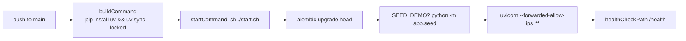

# 0011. Host the backend on a Render free web service

- **Status:** Accepted
- **Date:** 2026-08-10 (decided), 2026-08-11 (deployed)
- **Deciders:** llevintza
- **Landed in:** PR #3 (`d1caed3`), deployed via issue #7, region corrected in PR #12 (`1963057`)
- **Related:** [ADR-0012](0012-database-hosting-neon.md), [ADR-0013](0013-co-locate-api-and-database-region.md), [ADR-0014](0014-split-liveness-and-readiness-health-checks.md)

## Context

The API is a containerless Python process that must be reachable over HTTPS from a
GitHub Pages origin, run Alembic migrations on deploy, and cost nothing while the
project is a personal proof of concept. Traffic is one user and a scheduled ingest
job — effectively zero.

The constraint that shaped the choice: **the free tier must be genuinely free, with
no credit card and no trial clock.** A 12-month trial that silently converts to
billing is worse than no free tier, because the failure mode is a surprise invoice.

Deployment also had to be reproducible from the repository rather than from
dashboard clicking, so that recreating the service — which we in fact had to do —
is a known quantity.

## Decision

We use a **Render web service on the `free` plan**, defined as a Blueprint in
[`render.yaml`](../../render.yaml) at the repository root. Render watches `main` and
auto-deploys on push.

Configuration is declared in the Blueprint, with exactly one value entered by hand:

| Variable | Source | Why |
| --- | --- | --- |
| `DATABASE_URL` | `sync: false` — dashboard only | A secret; must never be committed |
| `JWT_SECRET` | `generateValue: true` | Render generates it; nobody ever sees it |
| `CORS_ORIGINS` | committed | Bare origin `https://llevintza.github.io` |
| `FRONTEND_URL` | committed | Full base URL *including* `/energlens` |
| `SEED_DEMO` | committed | See [ADR-0015](0015-demo-seed-in-production.md) |

Three details in that file are load-bearing and should not be "cleaned up":

- **`uv sync --locked`, not `--frozen`.** `--frozen` installs the committed lock
  without checking it still matches `pyproject.toml`, which converts lockfile drift
  from a build-time error into a `ModuleNotFoundError` crash-loop at runtime.
- **`--forwarded-allow-ips '*'`.** Render's TLS proxy connects from a non-loopback
  address. Without trusting it, `request.url_for` builds `http://` URLs and OAuth
  fails with `redirect_uri_mismatch`.
- **Migrations run at process start**, not in a pre-deploy hook, because the free
  tier has neither pre-deploy hooks nor shell access. `start.sh` runs under `set -e`,
  so a bad `DATABASE_URL` aborts the boot with a real error.

## Consequences

### What this buys

- **$0/month**, no card, no trial clock.
- **Infrastructure as code.** The service is reproducible from `render.yaml`; the
  only manual step is pasting one secret.
- **Auto-deploy on merge**, with no CI credentials to manage — Render pulls, rather
  than Actions pushing, so no deploy token exists to leak.
- Native HTTPS on `*.onrender.com`, so no certificate management.

### What this costs

- **Cold starts are user-visible.** The service sleeps after 15 minutes idle and
  takes 30–60s to wake. For a personal tracker this is tolerable; for anything with
  real users it is not.
- **Migrations run on every boot.** Idempotent and cheap (one query when already at
  head), but it means a broken migration takes the service down rather than failing a
  deploy step.
- **A wrong hostname fails misleadingly.** `*.onrender.com` is a wildcard, so a
  typo'd or stale host returns a plausible HTTP 404 — not a DNS failure. This burned
  us: `API_URL` was set to a *guess* at the hostname and returned convincing 404s
  while nothing was deployed at all. See issue #11.
- **Vendor coupling is small but real**: `render.yaml`, the `$PORT` convention, and
  the proxy-trust flag. All of it is a day's work to replace.

## Limitations

| Limit | Value | Consequence |
| --- | --- | --- |
| RAM | 512 MB | Fine for uvicorn + SQLAlchemy; a pandas-style ingest would not fit |
| Idle spin-down | 15 min | 30–60s cold start on the next request |
| Instances | 1 | No horizontal scaling, no zero-downtime deploys |
| Pre-deploy hooks | none | Migrations must ride on startup |
| Shell access | none | No `psql` from the service; debugging is log-only |
| Build minutes | limited on free | Rare in practice at this commit rate |

**One operational surprise worth knowing about.** After the service was first
created, Render's edge routed inconsistently for ~15 minutes — independent requests
to the same hostname alternated between the app and a `no-server` 404, oscillating
rather than converging (4/10 → 8/10 → 15/20 → 8/20). A **Manual Deploy → Clear build
cache & deploy** resolved it, and it has been stable since. Recorded as issue #13.

## Alternatives considered

| Option | Why not |
| --- | --- |
| **Fly.io** | Free allowance now requires a card on file and converts to pay-as-you-go; the surprise-invoice failure mode we explicitly wanted to avoid |
| **Railway** | Trial credit expires rather than renewing — not a durable free tier |
| **AWS App Runner / ECS Fargate** | No meaningful free tier; needs VPC, IAM and ALB setup that dwarfs the app |
| **AWS Lambda + API Gateway** | Genuinely cheap, but asyncpg connection pooling across cold invocations needs RDS Proxy or equivalent, and Mangum adds a translation layer. Real option **later**, at scale |
| **Self-hosted VPS** (Hetzner ~€4/mo) | Cheapest always-on, but we own patching, TLS renewal and backups — the opposite of the goal |
| **Render `starter` ($7/mo)** | The intended *next* step, not the first one. One-line change |

## Revisit when

- [ ] **Cold starts become the top complaint** → change `plan: free` to `starter`
      ($7/mo, always-on). One line, no other change. This is the expected first spend.
- [ ] **Memory pressure appears** (OOM restarts in Render logs) → `starter` also
      raises RAM.
- [ ] **More than one instance is needed**, or zero-downtime deploys matter → Render
      free cannot do either; move to a paid plan or a different platform.
- [ ] **Render changes free-tier terms**, or introduces a card requirement → re-run
      the alternatives table above.
- [ ] **Compliance requires data residency or an audit trail** the free tier does not
      provide.
- [ ] **The ingest job outgrows 512 MB.**

## Migration path

Deliberately shallow. The application knows nothing about Render beyond three things:
it reads `$PORT`, it trusts a forwarding proxy, and its build is described in
`render.yaml`.

**To any other container host** (Fly, Railway, ECS, a VPS with Docker):

1. Write a `Dockerfile` reproducing `buildCommand` + `startCommand` — the two lines
   already exist in `render.yaml`.
2. Recreate the five environment variables. `JWT_SECRET` changing will invalidate
   every issued token, logging all users out; that is acceptable but should be
   deliberate.
3. Point `API_URL` at the new host and **re-dispatch the Pages workflow** — the value
   is inlined at build time and the `paths` filter will not trigger on its own.
4. Update `CORS_ORIGINS` / `FRONTEND_URL` only if the frontend origin also changed.

No data lives here, so there is nothing to migrate — the database moves independently
([ADR-0012](0012-database-hosting-neon.md)). Estimated effort: **half a day**, most of
it verifying rather than writing.
