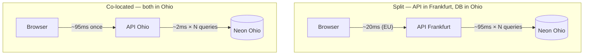

# 0013. Co-locate the API and the database in one region

- **Status:** Accepted
- **Date:** 2026-08-11
- **Deciders:** llevintza
- **Landed in:** PR #12 (`1963057`)
- **Related:** [ADR-0011](0011-backend-hosting-render.md), [ADR-0012](0012-database-hosting-neon.md)

## Context

`render.yaml` originally pinned the API to `frankfurt`, chosen because the user and
the seeded data are European. When the Neon project was actually created it landed in
AWS `us-east-2` (Ohio), producing a transatlantic split that nothing in the config
flagged.

**The cost of that split is paid per query, not per request.** This is the part that
is easy to get wrong when reasoning about it casually:

A dashboard page issuing 5 sequential queries pays **~475ms of pure network** when
split, versus ~95ms once when co-located. The split is worse the more work a page
does — exactly backwards from what you want.

## Decision

**The API and the database must sit in the same region.** Concretely, `render.yaml`
sets `region: ohio` to match the Neon project in AWS `us-east-2`, and the requirement
is recorded as a comment in the file itself so a future region edit is not made in
isolation.

Given a database already provisioned in Ohio, moving Render was the one-line fix.
The alternative — recreating Neon in `eu-central-1` and keeping Render in Frankfurt —
would have been equally valid and marginally better for a European user, at the cost
of redoing the database.

## Consequences

### What this buys

- Database round-trips drop from ~95ms to ~2ms, multiplied by every query on every
  request.
- Dashboard pages — the ones issuing the most queries — improve the most.

### What this costs

- **The browser now pays the transatlantic hop.** A European user is ~95ms from an
  Ohio API. This is paid **once per request** rather than once per query, so it is
  strictly better than the split, but it is not free.
- If the user base is firmly European, the *better* end state is both components in
  `eu-central-1` / `frankfurt`. This ADR does not claim Ohio is optimal — only that
  co-location beats splitting.

## Limitations

- **Render regions are immutable on an existing service.** Changing `region:` in the
  Blueprint forces Render to replace the service rather than move it, which can
  disrupt the hostname and routing. Decide the region *before* first apply.
- Neon's region is likewise fixed at project creation; changing it means a new
  project and a dump/restore.
- Neither provider offers multi-region replication on a free tier, so "close to
  everyone" is not available at this price.

## Alternatives considered

| Option | Why not |
| --- | --- |
| **Recreate Neon in `eu-central-1`, keep Render in Frankfurt** | Equally correct and better for an EU user; rejected only because the database already existed and was cheaper to keep than the service. **Reopen this if latency from Europe becomes noticeable** |
| **Leave the split, accept the latency** | Degrades exactly the pages that do the most work; the fix was one line |
| **Add a read replica near the API** | Neither free tier offers it; enormous complexity for a single-user app |
| **Cache aggressively to hide the latency** | Treats the symptom, adds invalidation bugs, and does nothing for writes |

## Revisit when

- [ ] **Page loads feel slow from Europe** → the fix is moving *both* to
      `eu-central-1` / `frankfurt`, not splitting them again. Requires recreating the
      Neon project (dump/restore) and replacing the Render service.
- [ ] **Either provider's region is changed for any reason** → change both, in the
      same PR. The comment in `render.yaml` exists to force this.
- [ ] **Users appear on more than one continent** → co-location can no longer serve
      everyone; that is a CDN-plus-read-replica conversation, and a different price
      tier.
- [ ] **Moving to AWS** ([ADR-0011](0011-backend-hosting-render.md),
      [ADR-0012](0012-database-hosting-neon.md)) → put the compute and RDS in the same
      AZ, not merely the same region.

## Migration path

To move the pair to Europe:

1. Create a new Neon project in `eu-central-1`; `pg_dump | pg_restore` from Ohio.
2. Change `render.yaml` to `region: frankfurt` **and** update the comment.
3. Because the region is immutable, delete and recreate the Render service; re-paste
   `DATABASE_URL` pointing at the new Neon endpoint.
4. Verify the hostname Render assigns — if it differs, `gh variable set API_URL` and
   re-dispatch the Pages workflow, since `API_URL` is inlined at build time.

Estimated effort: **half a day**, dominated by recreating the service and
re-verifying rather than by the data move.
