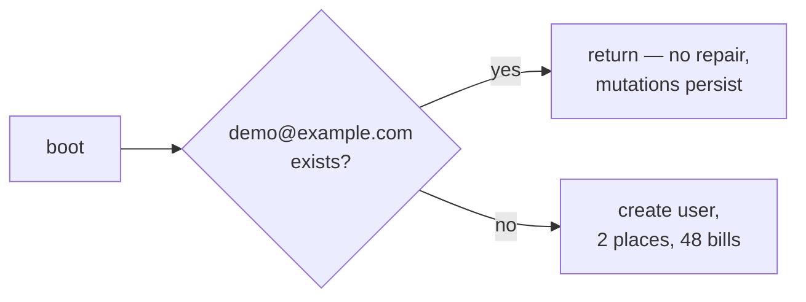

# 0015. Ship a public demo account in production

- **Status:** **Accepted (time-boxed)** — expires when real bills are entered
- **Date:** 2026-08-10 (decided), reaffirmed 2026-08-11 during deployment
- **Deciders:** llevintza
- **Landed in:** PR #3 (`d1caed3`)
- **Related:** [ADR-0006](0006-fastapi-users-jwt-auth.md), [ADR-0012](0012-database-hosting-neon.md)

## Context

The deployed site is a portfolio piece as much as a personal tool. A visitor landing
on a login screen with no way in sees nothing — the charts, the proration, the
multi-currency handling are all invisible without data.

`SEED_DEMO=true` in `render.yaml` makes `start.sh` run `python -m app.seed` on every
boot, creating `demo@example.com` / `demo1234` with two places and 24 months of
plausible bills each.

**These credentials are committed to this repository** — in
[`backend/app/seed.py`](../../backend/app/seed.py), the README, and the Makefile help
text. They are not a secret and were never intended to be.

## Decision

We ship the demo account **in production, deliberately, while the database holds
nothing but demo data.**

This is a security-relevant decision recorded explicitly rather than left implicit in
a config flag, because the reasoning is entirely dependent on a condition that will
change.

## Consequences

### What this buys

- Anyone can see the application working, immediately, with no signup.
- The seed doubles as a smoke test: a successful demo login on the live service
  proves migrations ran, the database is reachable, JWT signing works, and CORS is
  configured — in one request. It was used exactly this way when verifying the deploy.

### What this costs

**The demo account is writable by anyone who finds it.** The authenticated API allows
writes, so any visitor can add, edit or delete demo bills.

**Re-seeding does not repair it.** The seeder is idempotent by early-returning when
`demo@example.com` already exists — so once the data is mutated, a redeploy will *not*
restore it. Recovering means deleting the user and letting the next boot re-seed.



**It is a real account on a real auth system.** It consumes a row in `user`, and any
future authorization bug affecting one user affects this one — with published
credentials.

## Limitations

- Scoped to one user; the seeder never touches other users' data.
- Storage impact is negligible (48 rows).
- **No rate limiting exists anywhere in the API.** A published credential on an
  unthrottled write API is an abuse vector — small, because the blast radius is demo
  rows, but it is the reason this decision is time-boxed rather than permanent.

## Alternatives considered

| Option | Why not |
| --- | --- |
| **`SEED_DEMO=false`, register your own account** | Correct end state, and the plan for it is below. Rejected *for now* because it leaves the public site empty |
| **Read-only demo user** | The right answer if the demo must survive real data — needs a role/permission concept the app does not have. See revisit triggers |
| **Reset the demo on a schedule** | Needs a cron; Render free has no scheduled jobs. Possible via GitHub Actions later |
| **Seed on every boot, overwriting** | Would fight legitimate demo exploration and rewrite data mid-session |
| **Screenshots instead of a live demo** | Loses the interactive point of the site |

## Revisit when

**Any one of these fires → set `SEED_DEMO: "false"` in `render.yaml` and redeploy.**

- [ ] **The first real bill is entered.** This is the hard expiry. The demo account
      does not read other users' data, but a shared, published credential on a
      database containing personal financial records is an unnecessary risk with no
      remaining upside.
- [ ] **The demo data is defaced** and the site looks broken to visitors → delete the
      user and let the next boot re-seed, or turn the flag off.
- [ ] **Rate limiting is still absent** when traffic becomes non-trivial.
- [ ] **A read-only role or per-user quota is implemented** → the demo can become
      permanent and safe, and this ADR is superseded rather than expired.
- [ ] **Authorization changes in any way** → re-verify the demo user cannot reach
      another user's places or bills.

## Migration path

Turning it off:

1. Set `SEED_DEMO: "false"` in [`render.yaml`](../../render.yaml); Render redeploys on
   merge.
2. Delete the demo user in the database — the flag stops *creating* it, it does not
   remove an existing one:
   ```sql
   DELETE FROM "user" WHERE email = 'demo@example.com';  -- places/bills cascade
   ```
3. Update the README so it no longer advertises credentials that do not work.

`ON DELETE CASCADE` on `places.user_id` and `bills.place_id` means step 2 removes the
places and bills with it. Nothing else references the demo user.
