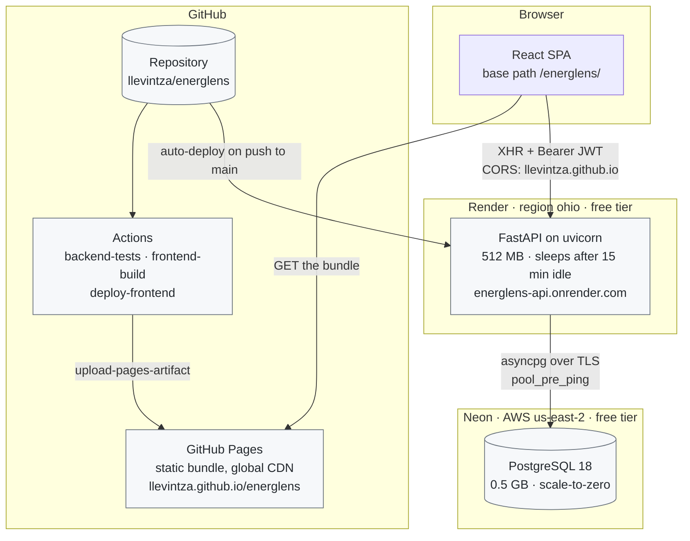
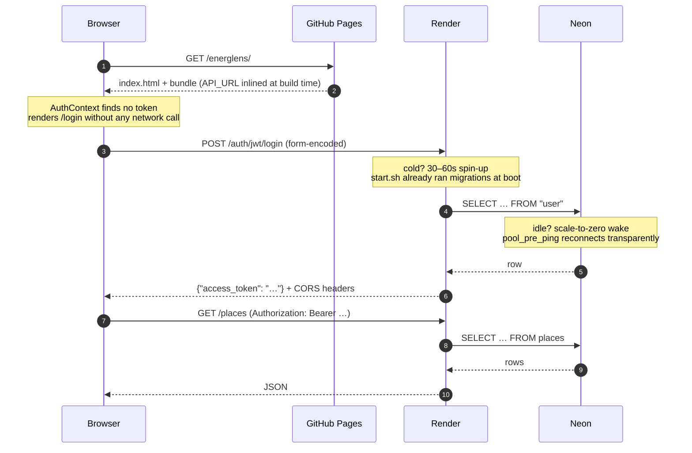
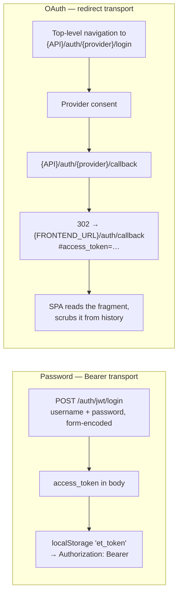
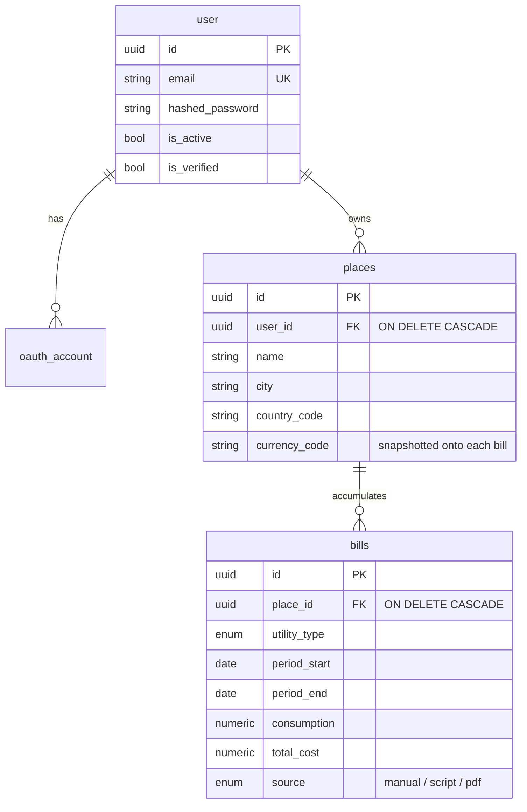
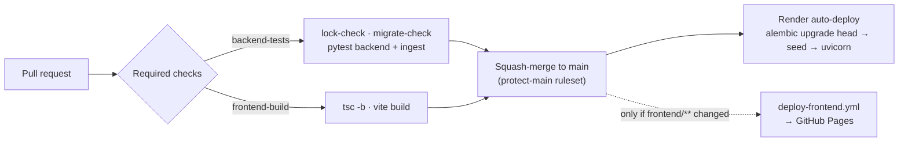
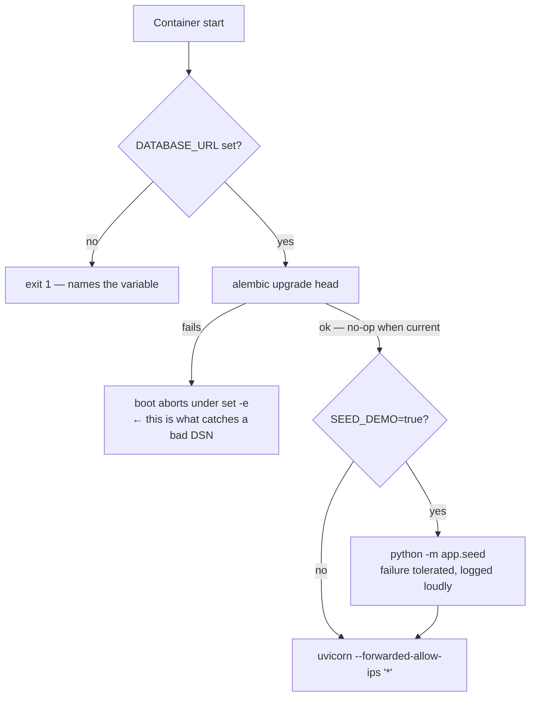

# Energlens architecture

The system view. Individual choices and their justifications live in
[`docs/adr/`](adr/) — this page is the map those decisions apply to.

Everything here reflects the deployment as it actually runs, verified end to end
on 2026-08-11.

---

## Deployment topology

Three hosted components, no servers of our own, **$0/month** at current tiers.

**The two hops that constrain everything else.** The browser→API hop crosses the
public internet and is therefore subject to CORS and cold starts; the API→database
hop happens per query, which is why the two must sit in the same region
([ADR-0013](adr/0013-co-locate-api-and-database-region.md)).

| Component | Provider | Tier | Hard limits |
| --- | --- | --- | --- |
| SPA | GitHub Pages | free | 1 GB site, 100 GB/mo bandwidth, public repo |
| API | Render web service | free | 512 MB RAM, sleeps after 15 min idle, 30–60s cold start |
| Database | Neon | free | 0.5 GB storage, scale-to-zero after ~5 min |

---

## Request lifecycle

What happens on a cold system, including the two sleep behaviours that make the
first request slow but not broken.

`pool_pre_ping=True` ([`backend/app/db.py`](../backend/app/db.py)) is what makes step 8
survive: Neon drops the server side of pooled connections while the process stays
alive, so without a liveness check the first query after an idle gap fails with
`ConnectionDoesNotExistError` instead of reconnecting.

---

## Authentication

Two token deliveries, one JWT strategy
([`backend/app/auth/backend.py`](../backend/app/auth/backend.py)).

Three non-obvious constraints, each of which breaks the flow if violated:

- **The OAuth start is a top-level navigation, not `fetch`.** fastapi-users v15
  requires the CSRF cookie to be first-party, which an XHR cannot achieve.
- **The token comes back in the URL *fragment*, not the query string.** Fragments
  are never sent to the server or written to server logs. The SPA calls
  `history.replaceState` before doing anything else
  ([`OAuthCallbackPage.tsx`](../frontend/src/auth/OAuthCallbackPage.tsx)).
- **`FRONTEND_URL` must include the `/energlens` base path**, while `CORS_ORIGINS`
  must be the bare origin. They are different values for a reason, and swapping
  them silently breaks either CORS or the OAuth redirect.

`--forwarded-allow-ips '*'` in [`backend/start.sh`](../backend/start.sh) exists for this
flow: Render's TLS proxy connects from a non-loopback address, and without trusting
it `request.url_for` builds `http://` URLs, failing OAuth with `redirect_uri_mismatch`.

---

## Data model

**`UNIQUE (place_id, utility_type, period_start, period_end)`** on `bills` is what
makes ingestion idempotent — re-importing the same PDF conflicts instead of
duplicating. Monthly series are *derived* from these periods by day-overlap
proration ([`backend/app/services/series.py`](../backend/app/services/series.py)) rather
than stored, because real bills do not align to calendar months.

---

## Delivery pipeline

`make check` is defined as the union of the two required jobs, so the local gate and
CI cannot disagree ([ADR-0002](adr/0002-monorepo-with-make-as-command-surface.md)).

**The dotted edge is a real trap.** `deploy-frontend.yml` has a `paths` filter of
`frontend/**`, and `API_URL` is inlined into the bundle at *build* time. Changing the
`API_URL` repository variable therefore triggers no deploy at all — it needs an
explicit `gh workflow run`. This is tracked in
[#11](https://github.com/llevintza/energlens/issues/11).

---

## Boot sequence

Render's free tier has no pre-deploy hook and no shell access, so schema management
rides on process startup ([`backend/start.sh`](../backend/start.sh)).

A bad connection string is caught **here**, not by the health check — `/health` is
deliberately static ([ADR-0014](adr/0014-split-liveness-and-readiness-health-checks.md)).

---

## Environments

| | Local | CI | Production |
| --- | --- | --- | --- |
| Database | `energlens` (local PG) | `energlens_test` (service container) | Neon `neondb` |
| Schema built by | Alembic or `create_all` | `create_all`, plus Alembic in `migrate-check` | Alembic only |
| Config source | `.env` via direnv | workflow `env` | Render env vars |
| Secrets | gitignored `.env` | repo variables | Render dashboard |

Three local databases exist for a reason — see
[ADR-0005](adr/0005-alembic-migrations-and-three-databases.md). The short version:
checking migrations against the *test* database would compare the models with
themselves and never detect drift.
